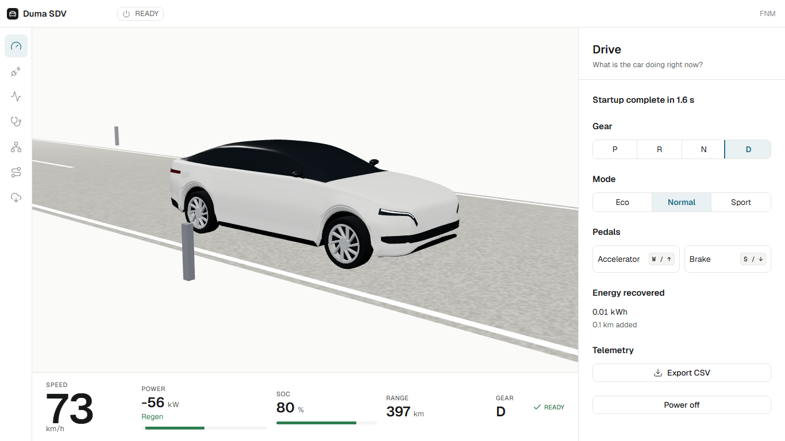
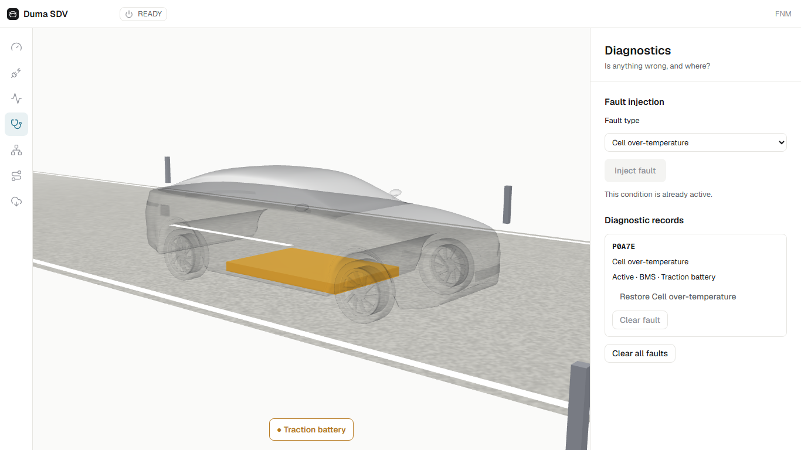
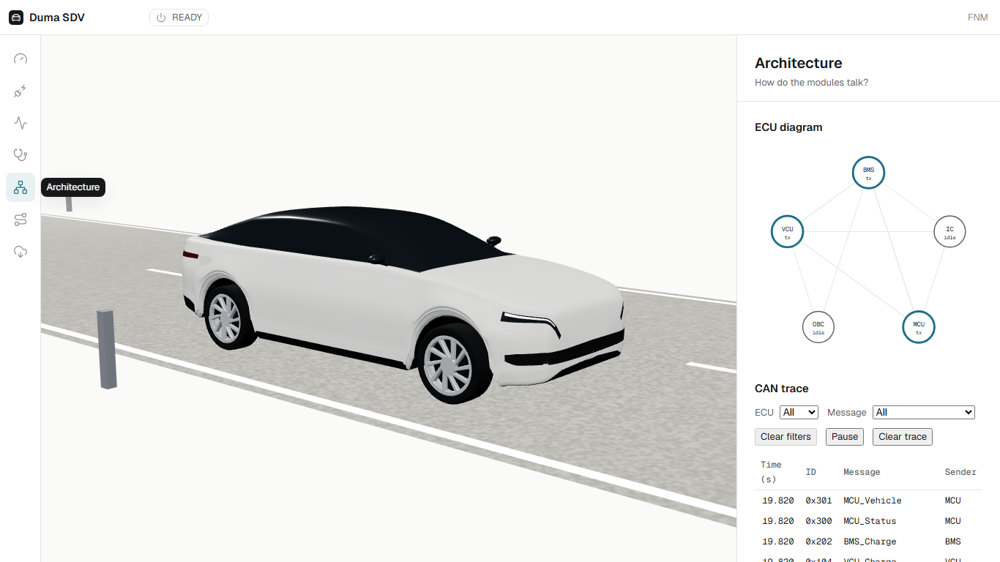
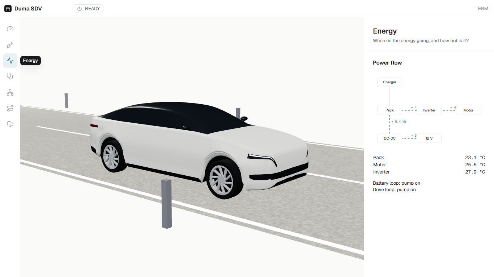
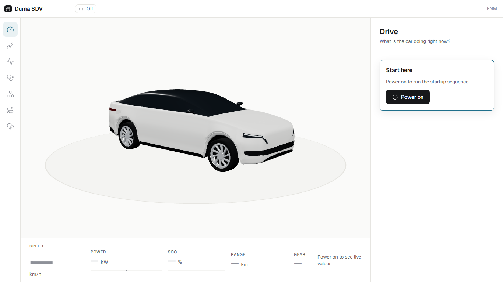
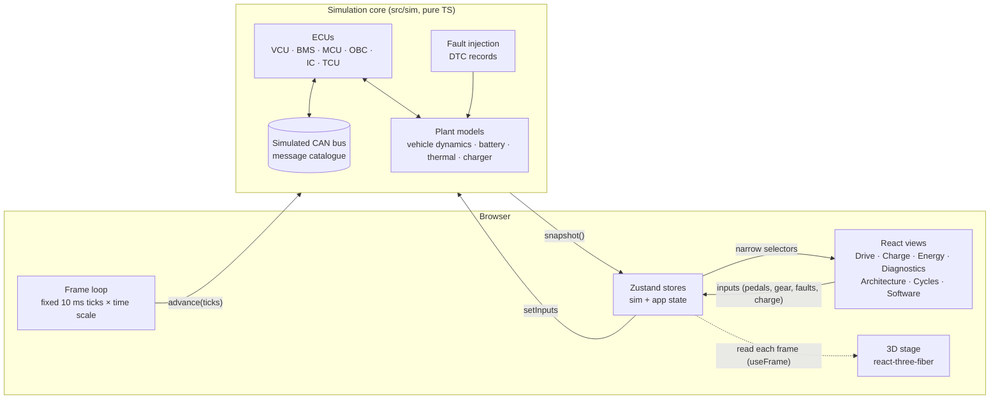
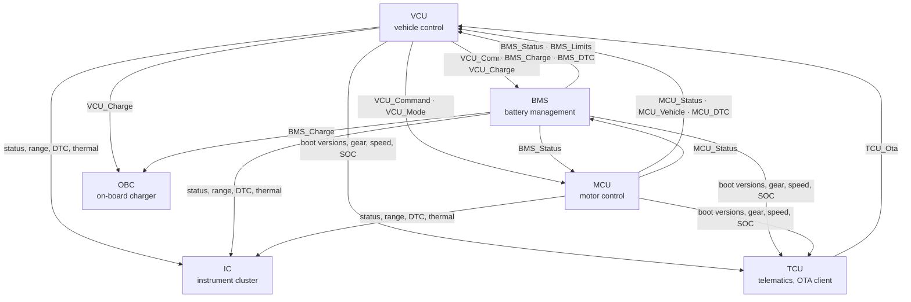
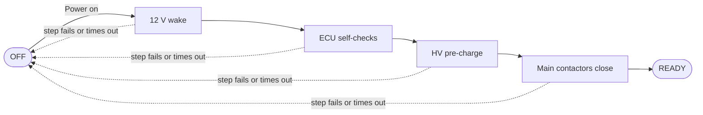
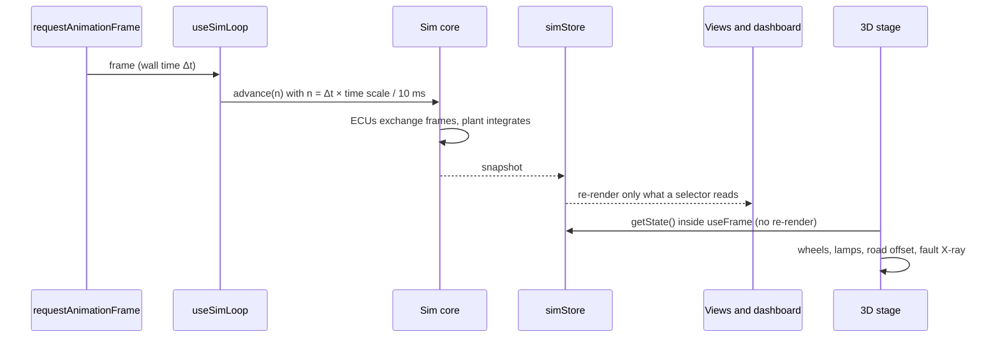

# Duma SDV

**A browser-based digital twin of a software-defined electric vehicle.** You can power the car on, drive it, charge it, inject faults and watch the software respond. A live 3D car, a driver dashboard and a simulated CAN bus show how the vehicle's ECUs work together.

Built for the *Software-Defined Electric Vehicle Design Challenge* (Tech Week 2026). Author: **FNM**.




---

## Contents

- [Why this exists](#why-this-exists)
- [What you can do](#what-you-can-do)
- [Quick start](#quick-start)
- [Controls](#controls)
- [Architecture](#architecture)
- [Physics you can check](#physics-you-can-check)
- [Project layout](#project-layout)
- [Testing](#testing)
- [Design decisions](#design-decisions)
- [Roadmap](#roadmap)

## Why this exists

Most entries to an SDV design challenge are architecture diagrams and a basic GUI. Judges then have to trust that the pieces would work together. Duma SDV makes the design something you can **run and check**:

- Every required scenario (startup, driving, regenerative braking, charging, fault notification) and an over-the-air update run live, and **Start demo** plays them all with captions.
- Each ECU is its own module, and they talk **only** through a simulated CAN bus with a message catalogue. The trace view shows every frame.
- The physics is calibrated to a published reference car. Automated tests hold the key figures to ±10 %.
- It runs fully offline from a laptop: the production build is a PWA whose service worker caches the whole app.

## What you can do

| View | The question it answers | Highlights |
|---|---|---|
| **Drive** | What is the car doing right now? | Power-on sequence, gears, Eco / Normal / Sport (Sport after the OTA update), keyboard or on-screen pedals, speed / power / SOC / range dashboard, trip energy recovered, CSV export |
| **Charge** | How is charging going? | AC (on-board charger) or DC fast charge, target SOC, live charge curve, time to target, charge-port state on the car |
| **Energy** | Where is the energy going? | Live power flow pack ↔ inverter ↔ motor, charger → pack, DC-DC → 12 V; pack, motor and inverter temperatures with coolant loops |
| **Diagnostics** | Is anything wrong, and where? | Inject faults, DTCs (active and stored), derate and limp modes, plain-language warnings, X-ray view of the car with the faulted module glowing |
| **Architecture** | How do the modules talk? | ECU diagram with live activity, a CAN trace you can filter and pause, signal-level detail for each frame |
| **Cycles** | How efficient is it? | WLTC Urban and Highway drive cycles with a speed-tracking driver, speed / power / SOC chart and a Wh/km result |
| **Guided demo** | (top bar) | **Start demo** plays Startup, Driving, Regen, AC and DC charging, Fault and OTA with captions; pick any scenario or skip ahead. A Start here card walks first-time users through five steps |
| **Software** | What version is running, and what is new? | Over-the-air update: check, download, verify, install into the VCU's inactive firmware bank and restart; ECU versions; the update unlocks Sport |

| Fault view (X-ray) | Architecture and CAN trace |
|---|---|
|  |  |

| Energy flow and thermal | Parked, before power-on |
|---|---|
|  |  |

## Quick start

Prerequisites: **Node 26** and npm 11.

```bash
npm ci
npm run dev          # http://localhost:5173
```

Production build, which also works offline at a venue with no network:

```bash
npm run build
npm run preview      # http://localhost:4173
```

### Offline at the venue

The production build is a PWA. A service worker precaches the whole app (the 3D stage, fonts and icons), so after one online load it runs with no network at all. Nothing is fetched from another site at runtime.

Offline check, on the laptop you will present from:

1. From a clean checkout, with network: `npm ci`, then `npm run build`.
2. Start the local server: `npm run preview`, and open http://localhost:4173 in Chrome or Edge. Wait for the car to appear.
3. Turn Wi-Fi off (or unplug the network).
4. Reload the page. The car and the dashboard appear as before.
5. Press **Power on** and check the top bar reaches READY, then press **Start demo** and let the guided demo play through.

`npm run preview` itself needs no network once `npm ci` has run, so steps 2 to 5 also work if the laptop never goes online again. Chrome and Edge also offer **Install app** in the address bar; the installed app opens offline in its own window. `e2e/offline.spec.ts` automates steps 2 to 5.

The build output in `dist/` uses relative paths, so the same folder can be served from any static host later. Public hosting is not set up yet.

### Gemini co-pilot setup

The co-pilot and the vehicle report's AI summary use the Gemini API. Everything else runs without it.

1. Get an API key from Google AI Studio.
2. Copy `.env.example` to `.env.local` (git-ignored) and set the key:

   ```bash
   GEMINI_API_KEY=your-key
   GEMINI_MODEL=            # text model; empty means gemini-3.5-flash-lite
   GEMINI_LIVE_MODEL=       # voice model; empty means gemini-3.8-live
   ```

3. Restart `npm run dev`. Vite reads env files only at start-up, so restart after every change. The **Co-pilot** view shows the status and the models in use.

To try another model, change `GEMINI_MODEL` or `GEMINI_LIVE_MODEL` and restart. Check model names in AI Studio: they change often.

**Using the co-pilot.** Open the **Co-pilot** view, pick English or Kiswahili, press **Start talking** and allow the microphone. Speak normally; you can talk over it. Press **Stop talking** to end the session.

| It can | It cannot |
|---|---|
| Tell you speed, charge, range, temperatures, faults and the software version | Press pedals or change gear |
| Switch drive mode (Sport only after the update) | Power the car on or off |
| Set the charge target, start and stop charging | Plug in or unplug the cable |
| Check for updates | Inject or clear faults, or install an update |

Every change goes through the same commands as the touchscreen, so the car can refuse, and the co-pilot tells you why ([ADR 0019](docs/adr/0019-copilot-acts-through-hmi-commands.md)). Try: "Switch to eco mode", "How far can I drive?", "Any faults?", "Set the charge target to 80 percent". In Kiswahili: "Badilisha hali iwe Eco", "Betri imebaki asilimia ngapi?", "Kuna hitilafu yoyote?", "Anza kuchaji".

The key is bundled into the app you build locally. **Never publish a build made with a key.** Tests never use your key: unit tests ignore `.env.local`, and the e2e server runs with blank `GEMINI_*` variables. Details in [ADR 0018](docs/adr/0018-gemini-integration-and-model-settings.md).

| Script | What it does |
|---|---|
| `npm run dev` | Vite dev server with hot reload |
| `npm run typecheck` | `tsc` on the app and the Node configs |
| `npm run lint` | ESLint, zero warnings allowed |
| `npm test` | Vitest unit and component tests |
| `npm run build` | Production build to `dist/` |
| `npm run e2e` | Playwright end-to-end specs (first time: `npx playwright install chromium`) |
| `npm run paper` | Regenerate the paper's data from the simulator and build `paper/main.pdf` (needs TeX Live) |
| `npm run paper:figures` | Recapture the paper's car renders and screenshots from the production build |

## Controls

| Input | Action |
|---|---|
| `W` / `↑` | Accelerator |
| `S` / `↓` | Brake (hold it to shift out of P) |
| `P` `R` `N` `D` | Gear selection |
| Mouse drag / wheel | Orbit and zoom the 3D stage |
| Time scale (1× to 120×) | Speeds up the simulation, so a long charge plays out in seconds |

## Architecture

### Layers

The simulation core is plain TypeScript with no React, DOM, three.js, wall clock or randomness. A lint rule enforces this. The UI and the 3D stage only read snapshots from it and send inputs to it.



### ECUs and the bus

Each ECU publishes its own messages and reads only what it subscribes to. The Architecture view draws this live from the same topology.



The catalogue has 18 periodic messages (10 ms to 1 s) from the VCU (`0x1xx`), BMS (`0x2xx`), MCU (`0x3xx`) and TCU (`0x4xx`), plus event-driven boot frames that carry each ECU's self-check result and software version.

### Power-on sequence



Each step has a timeout, and a failed step powers the car back down with a reason code (ADR 0005). An OTA update restarts the car through this same sequence, and the new VCU version shows up in its boot frame (ADR 0015). An authorised charge session moves the car to `CHARGING`. Gear changes are interlocked with the brake and road speed (ADR 0006).

### One frame



## Physics you can check

The vehicle model uses a published mid-size rear-wheel-drive EV as its reference (ADR 0001). The targets below are automated tests with ±10 % tolerance:

| Reference figure | Target | Tested window |
|---|---|---|
| 0–100 km/h | 5.9 s | 5.31–6.49 s |
| Range at a steady 100 km/h (82.5 kWh usable) | 510 km | 459–561 km |
| DC fast charge 10–80 % (150 kW peak, with taper) | 37 min | 33.3–40.7 min |

Estimates that aren't published (drive-mode maps, thermal masses and similar) are marked `// estimate` in the code and listed in their ADRs.

## Project layout

```text
src/
  sim/            Simulation core: pure TypeScript, deterministic, lint-enforced purity
    bus/          CAN bus and message catalogue
    ecus/         VCU, BMS, MCU, OBC, IC, TCU
    ota/          Update server package and OTA timings
    vehicle/      Parameters, road load, motor, traction, dynamics
    battery/      Pack and HV circuit
    thermal/      Lumped thermal masses and coolant loops
    faults/       Fault catalogue, DTC records, derate and safety responses
    scenarios/    Drive cycles (WLTC), cycle runner, scripted scenarios
    telemetry/    Recorder and CSV export
  app/            React views, panels, stores, input and the frame loop
  three/          3D stage: procedural car (car/), road (road/)
  ui/             Design tokens and shared primitives
e2e/              Playwright specs, one per user flow
specs/            Brief, mission, tech stack, roadmap, per-feature specs and tickets
docs/adr/         Architecture decision records
docs/images/      README screenshots
docs/design-rules.md  The UI contract every view follows
docs/glossary.md  Glossary
paper/            LaTeX paper: main.tex, generated data/ and captured figures/
```

## Testing

| Layer | Tool | What is covered |
|---|---|---|
| Simulation | Vitest (Node) | Bus timing, startup, interlocks, pedal maps, regen, AC/DC charging, faults and DTCs, thermal, drive cycles, telemetry, and the reference-figure tests |
| UI and 3D | Vitest + Testing Library (jsdom) | Every panel, the car model's parts and budgets, X-ray fault view, road motion helpers |
| End to end | Playwright (Chromium, 1366×768) | Power on, drive, regen, AC and DC charging, faults, architecture trace, energy, cycles with CSV export, OTA update, each scenario played from the guided demo, and an offline reload |

The simulation runs in fixed 10 ms ticks with no wall clock or randomness, so every test is deterministic. Vitest runs with at most four workers because the long reference runs are CPU-bound.

## Design decisions

Every non-obvious choice is written down in `docs/adr/`:

| ADR | Decision |
|---|---|
| [0001](docs/adr/0001-reference-car-byd-seal-rwd.md) | Reference car for the physics targets |
| [0002](docs/adr/0002-procedural-3d-car.md) | The 3D car is built in code, not loaded from a model file |
| [0003](docs/adr/0003-steady-100-range-target-basis.md) | Basis for the steady 100 km/h range target |
| [0004](docs/adr/0004-vehicle-model-estimates.md) | Vehicle-model estimates |
| [0005](docs/adr/0005-startup-sequence-and-hv-circuit.md) | Startup sequence and HV circuit |
| [0006](docs/adr/0006-gear-interlocks-outside-the-spec.md) | Gear interlocks |
| [0007](docs/adr/0007-drive-pedal-map-limiter-and-brakes.md) | Pedal map, limiter and brakes |
| [0008](docs/adr/0008-energy-soc-range-estimate-and-dashboard.md) | Energy, SOC and range estimate |
| [0009](docs/adr/0009-regenerative-braking-control.md) | Regenerative braking control |
| [0010](docs/adr/0010-external-charging-control.md) | External charging control |
| [0011](docs/adr/0011-fault-diagnostics-and-safe-control.md) | Fault diagnostics and safe control |
| [0012](docs/adr/0012-lumped-thermal-model.md) | Lumped thermal model |
| [0013](docs/adr/0013-drive-modes-and-drive-cycles.md) | Drive modes and drive cycles |
| [0014](docs/adr/0014-smooth-stylised-car-and-road-stage.md) | Smooth stylised car and road stage |
| [0015](docs/adr/0015-ota-software-update.md) | Over-the-air software update |
| [0016](docs/adr/0016-guided-demo-scripts.md) | Guided demo scripts |
| [0017](docs/adr/0017-bms-discharge-limit-at-the-battery.md) | The BMS discharge limit applies at the battery |

The UI follows [`docs/design-rules.md`](docs/design-rules.md): a light, restrained interface where each view answers one question, colour is used only for data and status, and every control is keyboard reachable.

## Roadmap

| # | Phase | Status |
|---|---|---|
| 01 | Scaffold | Done |
| 02 | Power on and drive | Done |
| 03 | Regenerative braking | Done |
| 04 | Charging (AC and DC) | Done |
| 05 | Faults and diagnostics | Done |
| 06 | Architecture and bus trace | Done |
| 07 | Energy flow and thermal | Done |
| 08 | Drive modes, drive cycles, telemetry export | Done |
| 09 | Stage visual refresh | Done |
| 10 | Over-the-air software update | Done |
| 11 | Guided demo mode | Done |
| 12 | Offline (PWA); public hosting deferred | Done |
| 13 | LaTeX paper | Done |
| 14 | Stretch: open-world drive | Optional |

The full plan is in [`specs/roadmap.md`](specs/roadmap.md).

---

Duma SDV is a fictional vehicle. It uses no manufacturer's name, logo or branding. The reference car appears only as the source of published figures for the physics tests.
